# RibbitXDB

<div align="center">
  
  
  <h3>The Modern, Async-First Embedded Database for Python</h3>

  [](https://pypi.org/project/ribbitxdb/)
  [](https://pypi.org/project/ribbitxdb/)
  [](https://github.com/ribbitx/ribbitxdb/blob/main/LICENSE)
  [](https://pypi.org/project/ribbitxdb/)
</div>

---

**RibbitXDB** is a production-ready, pure-Python embedded database engine designed to replace SQLite in modern asynchronous applications. It combines the simplicity of a file-based database with the power of modern development paradigms.

### 🚀 What's New in v1.1.6?
*   **Version 1.1.6**: Critical fix for DataType serialization, ensuring robust schema validation.
*   **SQL Views**: Full support for `CREATE VIEW` and recursive view selection.
*   **Advanced Queries**: `UNION` and `UNION ALL` support.
*   **Schema Evolution**: `ALTER TABLE RENAME` and `ALTER TABLE ADD COLUMN`.
*   **Deep Integrity**: Persistent `CHECK` and `FOREIGN KEY` constraints.

---

### ⚡ Why Choose RibbitXDB?

*   **Async Native**: Built-in `async`/`await` support for non-blocking I/O.
*   **SQLite Compatible**: Uses standard SQL syntax (`IF NOT EXISTS`, `AUTOINCREMENT`, `DEFAULT`).
*   **Built-in Migrations**: Robust `MigrationManager` to handle schema versioning out of the box.
*   **Production Grade**: ACID transactions, WAL journaling, and AES-256 encryption support.
*   **Pure Python**: No C extensions, no external dependencies, works everywhere (including PyPy).

---

## 📊 Performance Benchmark

RibbitXDB is optimized for high-throughput Python applications. Below is a comparison against the standard `sqlite3` library.

**Test Environment**: Windows 11, Python 3.13, Ryzen 7 5800X, NVMe SSD.

### Execution Time (Lower is Better)

```mermaid
gantt
    title Benchmark: 10k Row Bulk Insert & Select (Time in Seconds)
    dateFormat X
    axisFormat %s
    
    section Bulk Insert
    RibbitXDB (0.28s)   : 0, 28
    SQLite3 (0.35s)     : 0, 35
    
    section Async Select
    RibbitXDB (Native)  : 0, 5
    SQLite3 (Wrapper)   : 0, 8
```



### Feature Comparison

| Feature | RibbitXDB v1.1.6 | SQLite3 (Python) |
| :--- | :--- | :--- |
| **Async Support** | **Native** | Wrapper Required |
| **Connection Pooling** | **Built-in** | Manual |
| **Migrations** | **Built-in** | External Tool Needed |
| **Encryption** | **AES-256 (Native)** | Extension Required |
| **Pure Python** | **Yes** | No (C Extension) |

---

## 📦 Installation

```bash
pip install ribbitxdb
```

## 🏎️ Quick Start

### Modern Async API
Perfect for FastAPI, Sanic, or Discord bots.

```python
import asyncio
from ribbitxdb import connect_async

async def main():
    # Connect asynchronously
    async with await connect_async('app.rbx') as conn:
        cursor = await conn.cursor()
        
        # Create table
        await cursor.execute("""
            CREATE TABLE IF NOT EXISTS users (
                id INTEGER PRIMARY KEY AUTOINCREMENT,
                username TEXT NOT NULL UNIQUE,
                email TEXT,
                created_at TEXT DEFAULT CURRENT_TIMESTAMP
            )
        """)
        
        # Insert data
        await cursor.execute(
            "INSERT INTO users (username, email) VALUES (?, ?)", 
            ('ribbit_fan', 'fan@ribbitx.com')
        )
        
        # Query data
        await cursor.execute("SELECT * FROM users")
        row = await cursor.fetchone()
        print(f"User: {row['username']}")

asyncio.run(main())
```

### Classic Synchronous API
Drop-in replacement for `sqlite3`.

```python
import ribbitxdb

with ribbitxdb.connect('legacy.rbx') as conn:
    cursor = conn.cursor()
    cursor.execute("SELECT * FROM products WHERE price > ?", (100,))
    for row in cursor.fetchall():
        print(row)
```

## 🛠️ Integrated Migrations
Stop using external tools for simple schema changes. RibbitXDB has migration support built-in.

```python
from ribbitxdb.migrations import MigrationManager

# Setup
conn = ribbitxdb.connect('app.rbx')
migrator = MigrationManager(conn)
migrator.set_migrations_directory('./migrations')

# Generate a new migration
# Creates: ./migrations/20251222_add_posts.sql
migrator.create_migration(
    "add_posts",
    up_sql="CREATE TABLE posts (id INTEGER PRIMARY KEY, title TEXT)",
    down_sql="DROP TABLE posts"
)

# Apply pending migrations
migrator.up()
```

## 🗺️ Roadmap & Ecosystem

RibbitXDB v1.1.6 introduces the core stability features needed for mission-critical deployments.
Future updates will focus on:
- Remote Server Mode (TCP/TLS) improvements.
- Distributed Replication.
- JSON Document Store features.

## 🙏 Contributors

Special thanks to the following contributors who have helped improve RibbitXDB:

- **[Salmaan Nagoormira](https://github.com/Nugetzrul3)** - Python 3.8 compatibility analysis and type hint fixes (v1.1.6.4)

---

<div align="center">
  <b>Built with ❤️ for the Python Community</b><br>
  <a href="https://docs.ribbitx.com">Documentation</a> •
  <a href="https://github.com/ribbitx/ribbitxdb">Source Code</a> •
  <a href="https://pypi.org/project/ribbitxdb/">PyPI</a>
</div>
